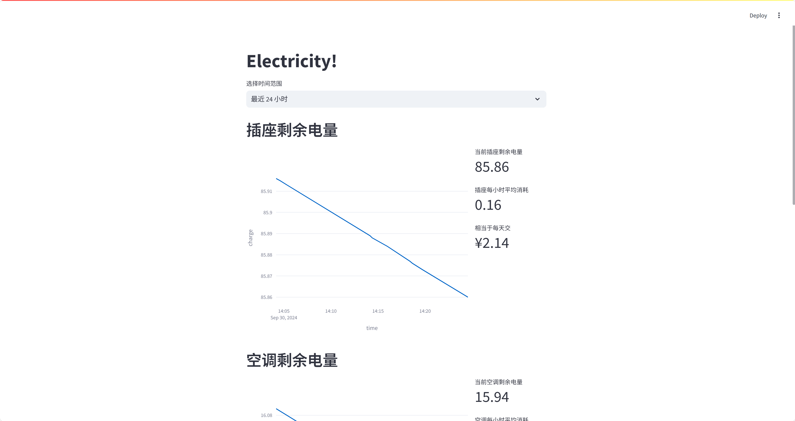
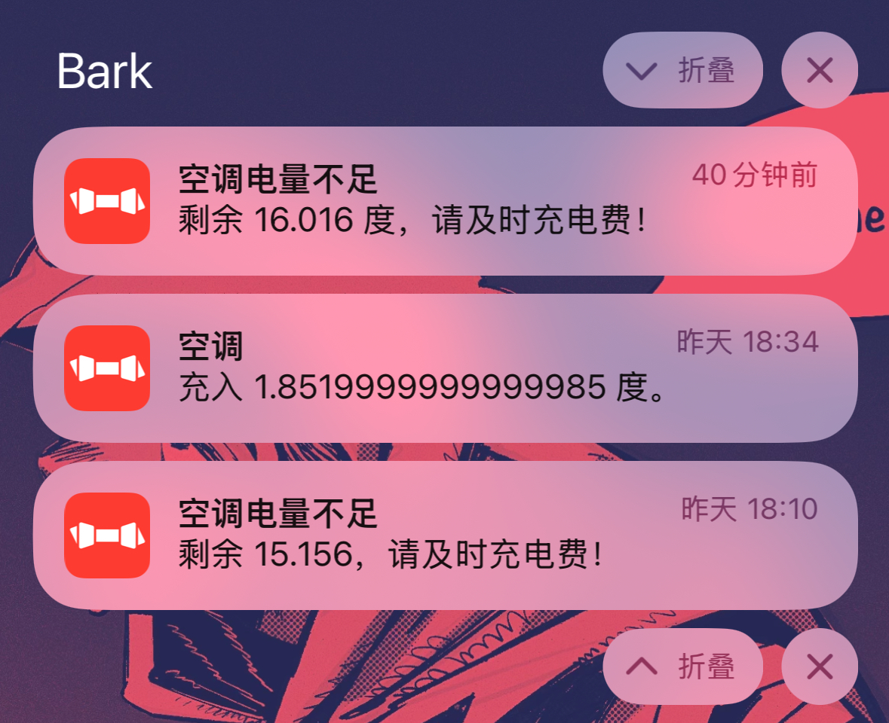

# OUC Electricity Monitor

[](https://dorm.jrhim.com/)

一个监控电费变化的工具，实现了电量余量监控、可视化和通知。原始实现源于[白佬](https://github.com/3401797899)。

## 预览



## 使用

### 编辑配置文件

请保证已连接到校园网，然后编辑 `config.toml` 文件，填入**学号**和数据库信息。

> [!NOTE]
> 如果对数据库使用不熟悉，建议除了在 student.id 处填写学号外，维持配置原样，程序会自动创建数据库文件。

```toml
[database]
type = "SQLite" # 数据库类型，支持 SQLite 和 MySQL

[student]
id = "your_student_id"    # 学号，请务必填写
root_url = "your_root_url"# 如果有自己部署的 Tunnel 服务，可以填写，否则留空或删除该行
electricity_fee = 0.54    # 电费单价，单位为 RMB/度

[cron]
interval = 5            # 定时任务执行间隔，单位为分钟，例如 5 表示每 5 分钟执行一次
crontab = "*/5 * * * *" # 定时任务执行时间，例如 "*/5 * * * *" 表示每 5 分钟执行一次

[visualize]
port = 8501            # 服务端口
title = "Electricity!" # 网站标题
icon = "⚡"             # 网站图标

[database.MySQL] # MySQL 数据库配置
host = "localhost"
port = 3306
user = "your_username"
password = "your_password"
database_name = "your_database_name"

[database.SQLite] # SQLite 数据库配置，初始化后会替换成绝对路径
file_path = "Electricity.db"

[notify.bark] # Bark 配置，用于推送电量告警和充电提醒
# https://bark.day.app/
enabled = false
device_token = "your_device_token"
```

对于 iOS 用户，如果需要推送通知，请填写 `bark` 配置项，`device_token` 为 Bark 的设备码。关于 Bark 的更多信息请参考 [Bark 官网](https://bark.day.app/) 或 [Bark GitHub](https://github.com/Finb/Bark)。



### 自动安装

> [!WARNING]
> 仅支持 Ubuntu + bash。

项目提供了一个 setup.sh 脚本，可以自动安装依赖并配置定时任务、部署服务。请确保已经编辑好了配置文件，然后确认以下几点：

- 请确保已经配置好 config.toml 文件。
- 请确保已经安装了 crontab。

    ```bash
    sudo apt install cron
    ```

- 如需使用 Bark 推送，请取消 requirements.txt 中的注释。
- 如果使用 MySQL 数据库，请取消 requirements.txt 中的注释。

然后，运行以下命令：

```bash
chmod +x setup.sh
./setup.sh
```

### 手动配置

首先，请确保您的 Python 版本为 3.8 及以上。创建虚拟环境：

```bash
python -m venv .venv
```

激活虚拟环境：

```bash
# Windows CMD
.venv\Scripts\activate.bat

# Windows PowerShell
.venv\Scripts\Activate.ps1

# macOS and Linux
source .venv/bin/activate
```

接着，根据 `requirements.txt` 安装依赖，关于 requirements.txt 的说明同自动安装脚本，请根据需要取消注释。

```bash
pip install -r requirements.txt
```

配置完成后，初始化数据库：

```bash
python init.py
```

初始化过程中程序会判断是否有多个空调终端，如果有则会提示选择一个，请注意选择自己的空调终端。如果选错了，可以再次运行 `init.py` 重新选择。如果运行顺利，在 `config.toml` 中会显示当前电费终端的信息。

接下来配置定时任务，可以使用 `crontab` 或者 Windows 任务计划程序。例如，每 10 分钟执行一次：

```bash
*/10 * * * * python get.py
```

最后运行 `visualize.py` 可以启动一个本地服务器，用于查看电费变化情况。

```bash
streamlit run visualize.py
```

## 注意

- 请勿将配置文件上传至公开仓库，其中包含了个人信息。
- 请勿频繁请求电费数据，以免对校园网造成影响。
- 对于电量的平均消耗计算仅供参考，在可视化页面选取较长的时间范围**可能**可以获取更准确的预测值。
